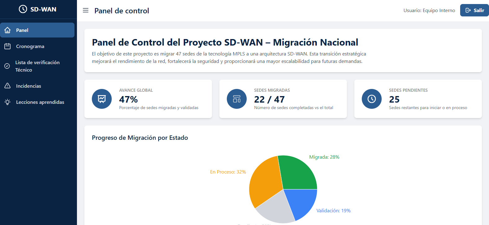

# 📊 SDWAN Dashboard

Panel de control desarrollado para visualizar...

# 📊 SDWAN Dashboard

Panel de control desarrollado para visualizar el avance del proyecto de migración de red de MPLS a SD-WAN, incluyendo métricas, componentes gráficos, navegación y arquitectura escalable basada en React y Vite.

---

## 🌐 Demo en vivo

- 🔵 **Netlify:** [https://sdwan-dashboard.netlify.app](https://sdwan-dashboard.netlify.app)  
- 🟢 **Vercel:** [https://sdwan-dashboard.vercel.app](https://sdwan-dashboard.vercel.app)

---

## 🛠 Tecnologías utilizadas

- ⚛️ React 19
- 🛣 React Router DOM
- 📊 Recharts
- 🔧 Vite
- ⌨️ TypeScript
- 📁 Deploy: Vercel & Netlify

---

## 📂 Estructura del proyecto

